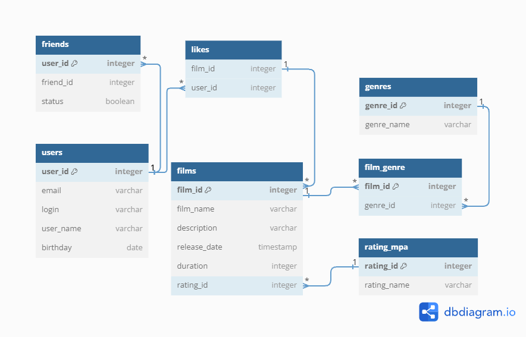

# java-filmorate
Template repository for Filmorate project.

  
Примеры запросов:  
1. Получение пользователя с id=1:  
   SELECT*  
   FROM users  
   WHERE user_id = 1;  
2. Получение фильма с ID = 10:  
   SELECT*  
   FROM films  
   WHERE film_id = 10.
